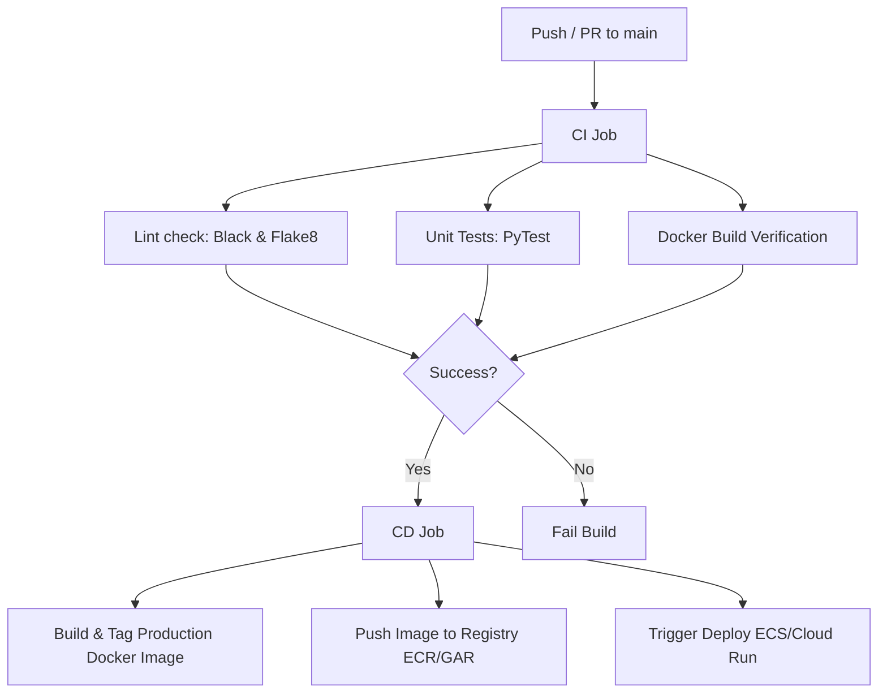

# MLOps CI/CD Model Deployment Pipeline

A complete template for Continuous Integration and Continuous Deployment (CI/CD) of machine learning models. The pipeline packages a FastAPI model server using a secure multi-stage Docker container and deploys it automatically to the cloud.

---

## Architecture Overview



## Directory Structure

*   `.github/workflows/deploy.yml`: GitHub Actions pipeline configuration.
*   `.aws/task-definition.json`: AWS ECS container configuration template.
*   `app/main.py`: FastAPI application serving predictions and exposing `/health`.
*   `app/requirements.txt`: Python package dependencies.
*   `tests/test_app.py`: Unit test suite testing server operations and error responses.
*   `Dockerfile`: Multi-stage Docker deployment script.

---

## Local Setup & Testing

### 1. Run FastAPI App Locally

Set up a virtual environment, install dependencies, and start the app:

```bash
# Create virtual environment
python -m venv venv
source venv/bin/activate

# Install dependencies
pip install -r app/requirements.txt

# Start Uvicorn Dev Server
uvicorn app.main:app --reload --port 8080
```

*   **Documentation:** Open [http://127.0.0.1:8080/docs](http://127.0.0.1:8080/docs) in your browser to view the interactive Swagger UI.
*   **Health check:** `curl http://127.0.0.1:8080/health`
*   **Predict endpoint:**
    ```bash
    curl -X 'POST' \
      'http://127.0.0.1:8080/predict' \
      -H 'accept: application/json' \
      -H 'Content-Type: application/json' \
      -D '{"features": [5.1, 3.5, 1.4, 0.2]}'
    ```

### 2. Run Tests Locally

Execute the test suite using `pytest`:

```bash
pytest tests/ -v
```

To run linting checks:
```bash
# Check formatting
black --check app tests

# Check style
flake8 app tests
```

### 3. Build & Run Docker Container Locally

Verify Docker container runs as expected:

```bash
# Build Docker image
docker build -t ml-model-api:latest .

# Run Docker container
docker run -p 8080:8080 ml-model-api:latest
```

---

## CI/CD Deployment Configuration

### Option A: AWS ECS (Elastic Container Service)
1. **GitHub Secrets:** Add the following secrets in your GitHub repository (`Settings > Secrets and variables > Actions`):
   * `AWS_ACCESS_KEY_ID`: Your AWS access key ID.
   * `AWS_SECRET_ACCESS_KEY`: Your AWS secret access key.
2. **AWS Pre-requisites:**
   * Create an ECR repository named `my-ml-model-repo`.
   * Create an ECS cluster named `ml-model-cluster`.
   * Create an ECS service named `ml-model-service` inside the cluster.
   * Set up an IAM policy allowing Github Actions runner to login, push to ECR, and update the ECS task definition.

### Option B: Google Cloud Run (GCP)
1. **GitHub Secrets:** Add the following secret:
   * `GCP_SA_KEY`: The JSON key file of a Service Account with permissions to push to Artifact Registry and deploy to Cloud Run.
2. **Pipeline configuration:**
   * Open `.github/workflows/deploy.yml`.
   * Comment out the `cd-deploy-aws` job.
   * Uncomment the `cd-deploy-gcp` job.
   * Customize the `GCP_PROJECT_ID`, `GCP_REGION`, `GAR_REPOSITORY`, and `SERVICE_NAME` environment variables.
