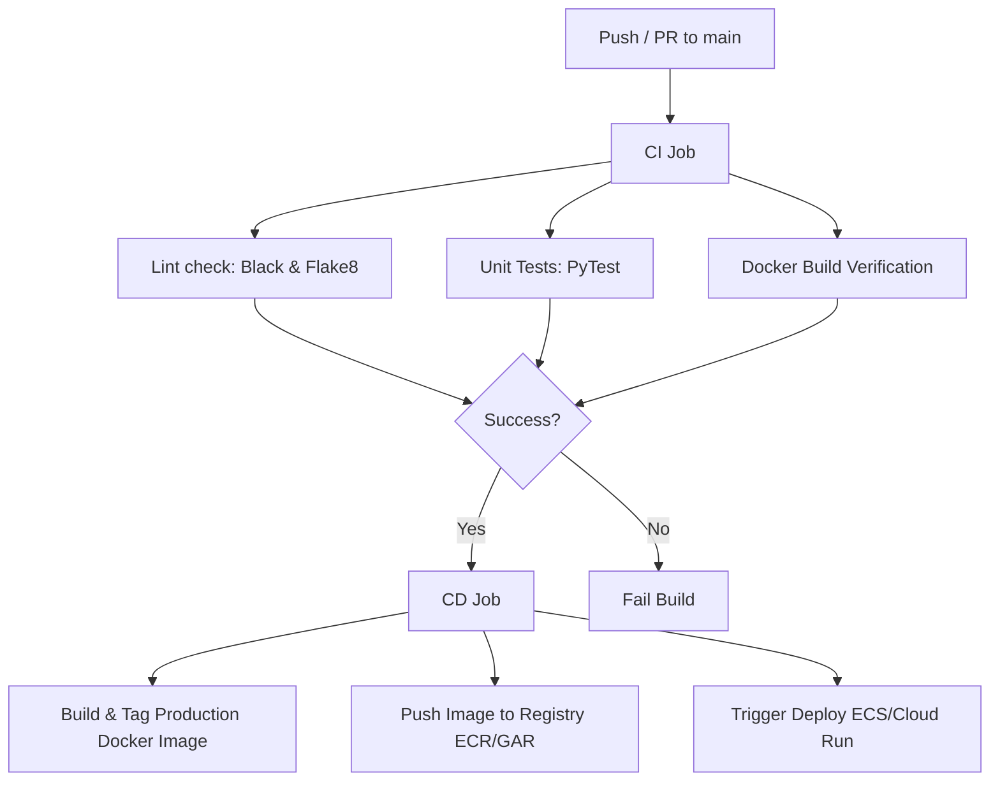
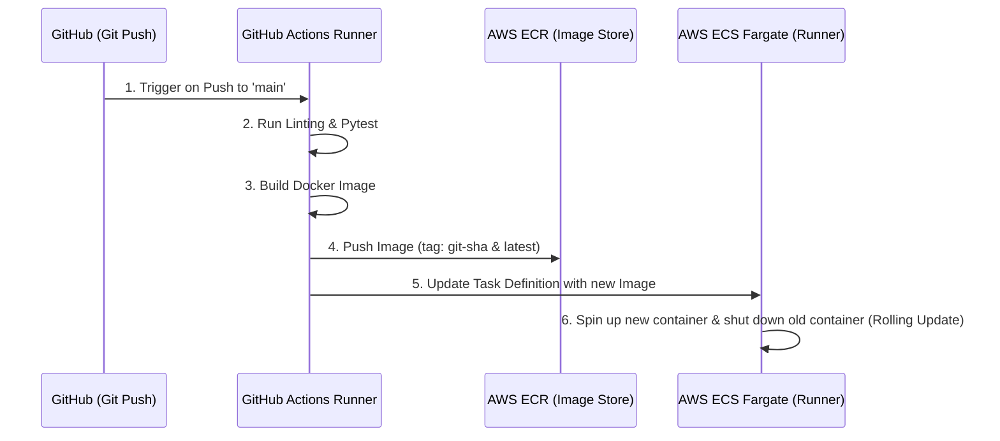

# MLOps CI/CD Model Deployment Pipeline

A complete template for Continuous Integration and Continuous Deployment (CI/CD) of machine learning models. The pipeline packages a FastAPI model server using a secure multi-stage Docker container and deploys it automatically to the cloud.

---

## Architecture Overview



## Directory Structure

*   `.github/workflows/deploy.yml`: GitHub Actions pipeline configuration.
*   `.aws/task-definition.json`: AWS ECS container configuration template.
*   `app/main.py`: FastAPI application serving predictions and exposing `/health`.
*   `app/requirements.txt`: Python package dependencies.
*   `tests/test_app.py`: Unit test suite testing server operations and error responses.
*   `Dockerfile`: Multi-stage Docker deployment script.

---

## Local Setup & Testing

### 1. Run FastAPI App Locally

Set up a virtual environment, install dependencies, and start the app:

```bash
# Create virtual environment
python -m venv venv
source venv/bin/activate

# Install dependencies
pip install -r app/requirements.txt

# Start Uvicorn Dev Server
uvicorn app.main:app --reload --port 8080
```

*   **Documentation:** Open [http://127.0.0.1:8080/docs](http://127.0.0.1:8080/docs) in your browser to view the interactive Swagger UI.
*   **Health check:** `curl http://127.0.0.1:8080/health`
*   **Predict endpoint:**
    ```bash
    curl -X POST \
  "http://127.0.0.1:8080/predict" \
  -H "accept: application/json" \
  -H "Content-Type: application/json" \
  -d '{
    "features": [5.1, 3.5, 1.4, 0.2]
  }'
    ```

### 2. Run Tests Locally

Execute the test suite using `pytest`:

```bash
pytest tests/ -v
```

To run linting checks:
```bash
# Check formatting
black --check app tests

# Check style
flake8 app tests
```

### 3. Build & Run Docker Container Locally

Verify Docker container runs as expected:

```bash
# Build Docker image
docker build -t ml-model-api:latest .

# Run Docker container
docker run -p 8080:8080 ml-model-api:latest
```

---

## CI/CD Deployment Configuration

### Option A: AWS ECS (Elastic Container Service) - No Helm/Kubernetes Required

This pipeline deploys directly onto **AWS ECS with Fargate** (AWS's serverless container runner). Fargate abstracts away all virtual machine or cluster management, meaning you do not need Kubernetes clusters, Helm charts, or virtual machine maintenance.

#### Deploy Sequence Flow



#### One-Time AWS Setup Guide

To get this pipeline running, you need to set up the following resources in your AWS account once:

1.  **Create a Container Registry (ECR):**
    *   Go to **Elastic Container Registry (ECR)** in the AWS Console.
    *   Click **Create Repository**.
    *   Set the name to **`my-ml-model-repo`** (matches the repository name in the `.github/workflows/deploy.yml`).
2.  **Create a serverless ECS Cluster:**
    *   Go to the **Elastic Container Service (ECS)** console.
    *   Click **Create Cluster**.
    *   Choose the **Fargate (Serverless)** template and name the cluster **`ml-model-cluster`**.
3.  **Register the Task Definition:**
    *   Create a Task Definition named **`ml-model-task`**. 
    *   Configure it to use **AWS Fargate** with `512 CPU` and `1024 Memory`.
    *   Add a container named **`ml-model-api`** pointing to your ECR image URL. Expose port `8080`.
    *   Alternatively, you can import the [.aws/task-definition.json](file:///Users/pareshmishra/Documents/development/mlops-pipeline/.aws/task-definition.json) file included in this repository.
4.  **Create the ECS Service:**
    *   Under your cluster, create a **Service** named **`ml-model-service`** using the task definition you created.
    *   This service will monitor your running containers and perform rolling updates whenever a new image is pushed.
5.  **Configure GitHub Actions Secrets:**
    *   Create an IAM User in AWS with permissions to interact with ECR, ECS, and update task definitions.
    *   Generate an Access Key and Secret Key for this user.
    *   Add them as GitHub Repository Secrets (`Settings > Secrets and variables > Actions > Secrets`):
        *   `AWS_ACCESS_KEY_ID`
        *   `AWS_SECRET_ACCESS_KEY`

---

### Option B: Google Cloud Run (GCP)
1. **GitHub Secrets:** Add the following secret:
   * `GCP_SA_KEY`: The JSON key file of a Service Account with permissions to push to Artifact Registry and deploy to Cloud Run.
2. **Pipeline configuration:**
   * Open `.github/workflows/deploy.yml`.
   * Comment out the `cd-deploy-aws` job.
   * Uncomment the `cd-deploy-gcp` job.
   * Customize the `GCP_PROJECT_ID`, `GCP_REGION`, `GAR_REPOSITORY`, and `SERVICE_NAME` environment variables.
